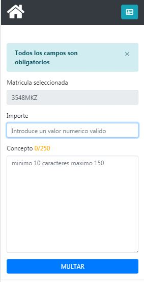

=========================
MULTOMETRO
=========================

Aplicación web para moviles , que registra multas.

TECNOLOGIAS
----------------
JAVAEE, MySQL, proyecto mavenizado 3.0 
Uso de JSLT expression language.
Maquetado con BOOTSTRAP.

Apendice Base de Datos
***************************
Instalar la base de datos adjunta, carpeta SQL.

DIAGRAMA ENTIDAD-RELACION
----------------

.. image:: SQL/diagrama.png

    
UX
----------------

Al registrarse el agente entra en la pagina de bienvenida.
Si seleccciona listar multas, el agente puede ver todas las multas que ha registrao
y el detalle de cada  multa.
Si seleccciona multar, pasa a otra pantalla con un buscador para matriculas validado  
Despues pasa a una pantalla dond debe introducir el importe de la multa y el concepto.
Multa registrada con exito

.. image:: capturas/Captura3.JPG

    
    
    